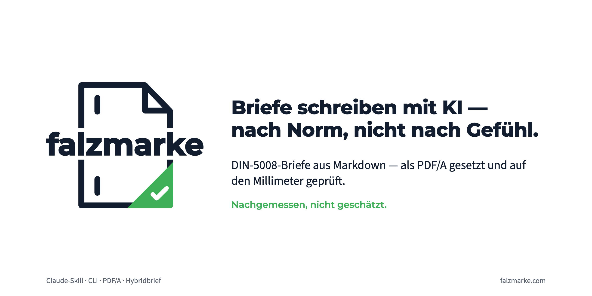
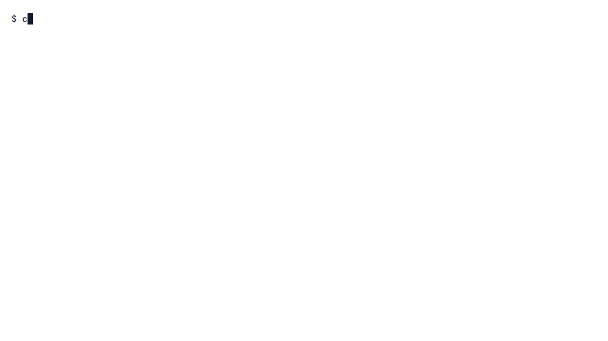

<div align="center">



[](https://github.com/blitzsicht/falzmarke/actions/workflows/ci.yml)
[](https://github.com/blitzsicht/falzmarke/releases/latest)
[](LICENSE)
[](pyproject.toml)
[](skill/references/din5008.md)

</div>

---

**Andere Werkzeuge erzeugen ein PDF. falzmarke prüft das Ergebnis.**

Du schreibst den Inhalt als Markdown. falzmarke setzt daraus einen Geschäftsbrief nach
DIN 5008:2020 als PDF/A — und misst anschließend das fertige PDF nach. Sitzt die Falzmarke nicht
auf 105,0 mm, endet der Lauf mit einem Fehler statt mit einem Brief, der nur ungefähr stimmt.

<div align="center">

**[⬇ Als Claude-Skill laden](https://github.com/blitzsicht/falzmarke/releases/latest/download/falzmarke.skill)** ·
**[In 60 Sekunden ausprobieren](#in-60-sekunden)** ·
**[Beispielbrief ansehen](docs/renders/brief-form-b.png)**

`Linux · macOS · Windows`  ·  `30 Maße je PDF`  ·  `PDF/A-2b`  ·  `MIT`

</div>

---

## In Bewegung



Aufgezeichnet aus der echten CLI mit [vhs](https://github.com/charmbracelet/vhs);
das Drehbuch steht in [`docs/marke/video/readme.tape`](docs/marke/video/readme.tape).
Ein Test hält den Mitschnitt gegen einen frischen Lauf, damit hier kein Terminal
steht, das es so nie gab ([`tests/test_tape.py`](tests/test_tape.py)).

---

## Was dabei herauskommt


Und was danach geprüft wird — Auszug aus dem Bericht, den jeder Lauf ausgibt:

```
OK    Falzmarke 1, y: soll 105.00 ist 105.00 (tol ±0.3)
OK    Infoblock, x-links: soll 125.00 ist 125.00 (tol ±0.5)
OK    Betreff, y-Oberkante: soll 98.47 ist 97.91 (tol -1.75/+0.6)
OK    Abstand Betreff → Anrede (2 Leerzeilen): soll 12.70 ist 12.70 (tol ±0.2)
```

Die erste dieser Zeilen spricht von einem Strich, den man auf einem Vorschaubild
kaum sieht — er ist 0,25 pt stark. Vergrößert sieht die Stelle so aus:


Dort wird der Bogen gefaltet, damit die Anschrift im Fensterumschlag steht. Sitzt die
Marke falsch, faltet der Stapel falsch — und das fällt erst nach dem Druck auf.

## Das Problem

Eine Briefvorlage kann nicht prüfen, ob das Ergebnis stimmt. Sie wird kopiert, jemand verschiebt
eine Zeile, und der Fehler fällt erst am fertigen Stapel auf: Die Anschrift steht nicht mehr im
Fensterausschnitt, alles muss neu gedruckt und kuvertiert werden — und wer mit Automationsrabatt
einliefert, verliert ihn für diese Sendung.

Sprachmodelle verschärfen das. Sie formulieren gut, aber sie können keinen Text auf 45,0 mm
setzen. Wer einen Brief von einer KI schreiben lässt, bekommt zuverlässig guten Inhalt in
unzuverlässigem Layout.

Und ein Renderer kann ebenfalls Fehler haben — auch dieser hier.

Deshalb trennt falzmarke drei Dinge: **Inhalt** kommt als Markdown, lesbar und versionierbar.
Das **Layout** setzt ein Renderer, der es immer gleich macht. Und die **Prüfung** misst das
fertige PDF, statt dem Renderer zu glauben.

## Warum nicht einfach Word oder ein Prompt?

Verglichen wird der typische Arbeitsablauf, nicht das Werkzeug an sich — mit einer sorgfältig
gepflegten Vorlage lässt sich vieles davon erreichen.

| | Vorlage in Word / LibreOffice | Brief direkt von einer KI | falzmarke |
|---|---|---|---|
| Quelle diffbar und versionierbar | teilweise | selten | ja — Markdown und YAML |
| Layout reproduzierbar | hängt an Vorlage und Umgebung | nicht zugesichert | ja — derselbe Renderer, dieselbe Ausgabe |
| Fertiges PDF wird nachgemessen | nein | nein | ja — 30 Maße, Abweichung ist ein Fehler |
| Absenderprofile | von Hand gepflegt | uneinheitlich | ja — einmal anlegen, überall nutzen |
| Prüfbericht maschinenlesbar | nein | nein | ja — `--json` und Exit-Codes |
| PDF/A als Voreinstellung | nicht automatisch | nicht zugesichert | ja — ohne zusätzliches Flag |

## Was du davon hast

- **Der Brief sitzt im Fensterumschlag** — Anschriftfeld, Falz- und Lochmarken werden am
  fertigen PDF vermessen, nicht beim Setzen angenommen.
- **Änderungen bleiben nachvollziehbar** — Markdown und YAML sind Textdateien. Ein Diff zeigt,
  was sich geändert hat; das PDF ist Ergebnis, nicht Quelle.
- **Ein Auftritt, viele Briefe** — Profile bündeln Briefkopf, Fußzeile, Logo, Farben und
  Voreinstellungen. Auch die Unterschrift, je Brief überschreibbar.
- **Fehler sind maschinenlesbar** — eigene Exit-Codes für Eingabe-, Geometrie- und
  Umgebungsfehler, dazu `--json`. Damit läuft es in CI und in Automatisierungen.
- **Für Langzeitarchivierung ausgelegt** — PDF/A-2b ohne zusätzliches Flag. Dass die Datei die
  Konformität wirklich einhält, sagt nicht dieses Werkzeug, sondern
  [veraPDF](https://verapdf.org/) — die Referenzimplementierung der PDF Association, in CI bei
  jedem Push. Optional PDF/UA-1 mit `--pdfua`, ebenfalls dort geprüft.
- **Im Gespräch oder im Terminal** — als Claude-Skill oder als CLI, ohne Systeminstallation.

## Woran man sieht, dass es stimmt

Das ist der Teil, an dem sich das Versprechen entscheidet — deshalb steht er vor der Installation.

- **Gemessen wird das fertige PDF**, nicht die Eingabe. `verify` liest das erzeugte Dokument mit
  pdfplumber und vergleicht Zonen, Marken und Abstände gegen die Sollwerte.
- **Jede tragende Prüfung hat eine [Gegenprobe](tests/test_gegenbeweis.py).** Sie läuft gegen ein
  absichtlich verschobenes Layout und muss dort anschlagen — ein Prüfmittel, das nie rot werden
  kann, wäre kein Nachweis. Das gilt auch für das Bild oben: Es entsteht zweimal, einmal aus dem
  ausgelieferten Layout und einmal aus einem, in dem die Marke 2 mm zu tief sitzt.

  

  Unterscheiden sich die beiden Ausschnitte nicht, zeigt der Ausschnitt die Marke gar nicht — dann
  ist das Bild oben wertlos, und `tests/test_detailbild.py` schlägt fehl.
- **CI auf Linux, macOS und Windows**, bei jedem Push.
- **Ein Frischinstallations-Test** führt die Befehle aus dieser README wirklich aus. Hier steht
  kein Befehl, den niemand ausprobiert hat.
- **Alle Beispielbriefe werden in CI gerendert** und vermessen.
- **Die PDF-Konformität bestätigt ein fremdes Werkzeug.** Alles andere auf dieser Liste misst mit
  demselben Code, der das PDF erzeugt hat — das belegt Selbsttreue, nicht Konformität.
  [veraPDF](https://verapdf.org/) hat den Brief nicht geschrieben und teilt keine Zeile mit dem
  Renderer. Geprüft wird, was die Datei selbst deklariert, auf der ausgelieferten Datei, mit
  Prüfsummen-Abgleich — und mit einer Gegenprobe, die ein absichtlich nicht-konformes PDF
  durchfallen lässt ([`scripts/pdf_konformitaet.py`](scripts/pdf_konformitaet.py)).
- **Die Layoutbasis ist vendort und prüfsummengesichert** —
  [`vendor/README.md`](skill/falzmarke/typst/vendor/README.md).

Zwei Aussagen, die gern verwechselt werden, hält das Projekt auseinander:

> **Der Sollwert ist fachlich belegt** und **der Verifier erkennt eine Abweichung davon** sind
> verschiedene Dinge. Das Zweite ist bewiesen. Das Erste hat Grenzen.

**Woher die Sollwerte stammen:** Maße und Schreibregeln folgen öffentlich dokumentierten Quellen
(Liste in [`skill/references/din5008.md`](skill/references/din5008.md)); der Abgleich mit dem
Originaltext der DIN 5008:2020-03 einschließlich Berichtigung 1:2020-07 steht aus. Regeln aus
einzelnen Quellen wirken nur als Warnung. Welche Regel worauf beruht, steht in der
[Quellenlage je Regel](skill/references/din5008.md#quellenlage-je-regel); was daraus rechtlich
folgt, in [`docs/recht.md`](docs/recht.md).

```bash
python3 -m pytest -q
```

## Sicherheit

Genannt wird nur, was im Code steht und geprüft ist. falzmarke ist **nicht** unabhängig
auditiert — Sicherheitsrelevantes bitte nach [SECURITY.md](SECURITY.md), nicht als Issue.

- **Verarbeitung bleibt lokal.** Der Renderpfad importiert keine Netzwerkbibliothek.
- **YAML wird ausschließlich mit `safe_load` gelesen** — an jeder Stelle, auch beim
  eingebetteten Profil.
- **Markdown läuft gegen eine Positivliste** von Knotentypen. Was nicht daraufsteht, ist ein
  Fehler mit Zeilenangabe — nie ein stilles Durchreichen.
- **Brieftext wird nie zu Typst-Code.** Der Emitter übergibt ihn als maskierte Zeichenkette;
  Sonderzeichen können die Struktur nicht verlassen.
- **Profil- und Briefdateien bleiben in ihrem Ordner.** Logo, Unterschrift und eigener Briefkopf
  dürfen nicht darüber hinauszeigen, Symlinks werden aufgelöst
  ([Gegenproben](tests/test_profilgrenze.py)).
- **Typst läuft auf ein eigenes Wurzelverzeichnis begrenzt**, Systemschriften sind abgeschaltet.
- **Alle Abhängigkeiten des Programms sind permissiv lizenziert** —
  [THIRD_PARTY_LICENSES.md](THIRD_PARTY_LICENSES.md).
- **Die CI-Aktionen hängen an vollständigen Commit-SHAs**, nicht an verschiebbaren Tags.

Das Release-Asset lässt sich auf seine Herkunft prüfen:

```bash
gh attestation verify falzmarke.skill --repo blitzsicht/falzmarke
```

Das belegt, aus welchem Lauf und welchem Commit die Datei stammt — **nicht, dass sie fehlerfrei
ist**. Die SHA-256-Summe steht in der Release-Notiz und als `falzmarke.skill.sha256` daneben.

## In 60 Sekunden

### Mit Claude

1. **[`falzmarke.skill` herunterladen](https://github.com/blitzsicht/falzmarke/releases/latest/download/falzmarke.skill)**
2. In Claude unter Einstellungen › Capabilities hochladen (Tarif mit Code-Ausführung nötig).
   Für Claude Code genügt ein Symlink:
   ```bash
   ln -s "$PWD/skill" ~/.claude/skills/falzmarke
   ```
3. „Schreib einen Brief an die Muster GmbH, Angebot über …"

### Im Terminal

```bash
uvx --from git+https://github.com/blitzsicht/falzmarke falzmarke \
    init brief.md --profil example --betreff "Angebot Nr. 2026-0815"
```

oder dauerhaft installiert, danach genügt `falzmarke render brief.md --png`:

```bash
pipx install git+https://github.com/blitzsicht/falzmarke
```

Noch liegt das Paket **nicht auf PyPI** — deshalb die Adresse statt eines bloßen Namens
([#7](https://github.com/blitzsicht/falzmarke/issues/7)).

Der Typst-Compiler kommt als Python-Wheel mit: **keine Systeminstallation**, kein LaTeX, kein
wkhtmltopdf, keine Schriftinstallation.

<details>
<summary>Aus einem Clone, ohne Installation</summary>

```bash
git clone https://github.com/blitzsicht/falzmarke.git
cd falzmarke
python3 skill/scripts/bootstrap.py
python3 skill/scripts/falzmarke.py render examples/brief-form-b.md --png
```

</details>

## Einen Brief schreiben

```markdown
---
profil: example
empfaenger:
  - Muster GmbH
  - Frau Erika Muster
  - Musterstraße 1
  - 12345 Musterstadt
datum: 2026-08-25
betreff: Angebot Nr. 2026-0815 über die Neugestaltung Ihrer Website
anrede: Sehr geehrte Frau Muster,
anlagen:
  - Angebot 2026-0815
---
vielen Dank für Ihre Anfrage vom 20. August 2026. Anbei erhalten Sie unser Angebot.

Die Umsetzung dauert ab Ihrer Freigabe **sieben Werktage**.
```

```bash
python3 skill/scripts/falzmarke.py render brief.md --png
```

Alle Felder stehen im [Datenvertrag](skill/references/frontmatter.md). Ein Feld, das dort nicht
steht, bricht mit Zeilennummer und Vorschlag ab — es wird nie stillschweigend verworfen.

### Was im Brieftext erlaubt ist

Der Text unter dem Frontmatter ist **falzmarke-Markdown**, eine dokumentierte Teilmenge von
[CommonMark](https://commonmark.org/):

| Das geht | Das erledigt falzmarke selbst |
|---|---|
| Absätze, `**fett**`, `*kursiv*` | `z. B.`, `10 %`, `§ 5` bekommen geschützte Leerzeichen |
| Aufzählungen und nummerierte Listen | `--` wird zum Halbgeviertstrich – so |
| Harter Umbruch mit `\` am Zeilenende | `"Wort"` wird zu „Wort“ |
| Pipe-Tabellen mit Ausrichtung | Tag und Monat bleiben zusammen: `25. August` |

Überschriften, Links, Bilder, Code und HTML sind **Fehler** — mit Zeile, Grund und Korrektur,
nie stillschweigend. Auf Papier gibt es keinen Link, und ein Bild im Fließtext verschöbe die
Geometrie, die danach gemessen wird.

Die vollständige Liste: [falzmarke-Markdown](skill/references/markdown.md).

## Beispiele

| Standardbrief | Einschreiben | Mehrseitig |
|---|---|---|
|  |  |  |
| Form B mit Informationsblock | Zusatz- und Vermerkzone | Kopfzeile und Seitenzählung |

Dazu Form A, Auslandsanschrift, Tabelle und ein Brief mit langem Informationsblock —
[alle Beispiele](examples/) und ihre [vollständigen Renderings](docs/renders/).

## Grenzen

- **[falzmarke-Markdown](skill/references/markdown.md) (CommonMark-Teilmenge)**: Absätze,
  fett, kursiv, Aufzählungen, nummerierte Listen, harter Umbruch, Pipe-Tabellen. Alles andere
  bricht mit Zeilenangabe ab, statt still etwas anderes zu setzen.
- **Zonengrößen der Norm**: Anschrift höchstens 6 Zeilen, Vermerke höchstens 3, Werte im
  Informationsblock höchstens 32 Zeichen.
- **Keine Bilder im Fließtext** — ein Logo gehört ins Profil.
- **Nur DIN 5008.** Schweiz (SN 010130) und Österreich (ÖNORM A 1080) sind vorgemerkt
  ([#10](https://github.com/blitzsicht/falzmarke/issues/10)); das Frontmatter-Feld `norm:` ist
  dafür reserviert.
- **Keine Signatur.** Das Unterschriftsbild ist Erscheinungsbild, kein Nachweis. Eine
  kryptografische Signatur ist Gegenstand von
  [#14](https://github.com/blitzsicht/falzmarke/issues/14).

## Weiterlesen

| | |
|---|---|
| [Befehle](docs/cli.md) | alle Unterbefehle, Exit-Codes, was geprüft wird |
| [Absenderprofile](docs/profiles.md) | Profil anlegen, Suchreihenfolge, eigener Briefkopf |
| [Datenvertrag](skill/references/frontmatter.md) | jedes Frontmatter-Feld mit Beispiel |
| [falzmarke-Markdown](skill/references/markdown.md) | was im Brieftext möglich ist |
| [Normmaße und Quellenlage](skill/references/din5008.md) | Sollwerte und ihre Herkunft |
| [Was falzmarke behauptet — und was nicht](docs/recht.md) | Grenzen der Normaussage |
| [Aufbau des Repositorys](docs/architecture.md) | Schichten, Vendoring, warum das Paket unter `skill/` liegt |
| [Roadmap](docs/ROADMAP.md) | in welcher Reihenfolge gearbeitet wird, und was noch offen ist |
| [Changelog](CHANGELOG.md) · [Releases](https://github.com/blitzsicht/falzmarke/releases) | was sich geändert hat |

## Mitmachen

Fehlerberichte und Vorschläge sind willkommen — siehe [CONTRIBUTING.md](CONTRIBUTING.md).
Bei einem Geometriefehler bitte die Ausgabe von `verify` mitschicken; ohne sie lässt sich nicht
unterscheiden, ob das Layout oder die Messung danebenliegt.

Sicherheitsrelevantes bitte nicht als Issue, sondern nach [SECURITY.md](SECURITY.md).

## Herkunft und Dank

**Markdown** wurde 2004 von [John Gruber](https://daringfireball.net/projects/markdown/) gemeinsam
mit Aaron Swartz entworfen. Die Spezifikation dazu ist [CommonMark](https://commonmark.org/)
(John MacFarlane und Mitwirkende). falzmarke setzt eine dokumentierte Teilmenge davon um
— **[falzmarke-Markdown](skill/references/markdown.md)** — und weicht an drei Stellen bewusst
ab: HTML wird nie durchgereicht, Links werden nie gesetzt, und eine einzelne `2. Text`-Zeile
ohne weitere Listenpunkte ist ein Fehler statt einer Liste.

Das **Seitenlayout** stammt von [typst-letter-pro](https://github.com/Sematre/typst-letter-pro)
(MIT) von Sematre und ist unverändert vendort — Prüfsumme in
[`vendor/README.md`](skill/falzmarke/typst/vendor/README.md). falzmarke ergänzt die Schicht
darüber: Datenvertrag, Profile, Markdown-Eingabe, Messung und den Skill.

Gesetzt wird mit [Typst](https://typst.app) (Apache-2.0), geparst mit
[markdown-it-py](https://github.com/executablebooks/markdown-it-py) (MIT), gemessen mit
[pdfplumber](https://github.com/jsvine/pdfplumber) (MIT) und
[pypdf](https://github.com/py-pdf/pypdf) (BSD-3). Schriften: Libertinus und Source Sans 3
(beide OFL 1.1). Die vollständige Aufstellung samt der Begründung, warum PyMuPDF (AGPL-3.0)
ersetzt wurde, steht in [THIRD_PARTY_LICENSES.md](THIRD_PARTY_LICENSES.md).

**Alle Abhängigkeiten des Programms sind permissiv lizenziert** — falzmarke lässt sich damit
auch in geschlossene Systeme einbauen. Nicht permissiv ist allein
[Remotion](https://www.remotion.dev), womit der Erklärfilm gerendert wird: am Programm ist es
nicht beteiligt und wird nicht mitgeliefert.

**DIN 5008** ist eine Norm des DIN Deutsches Institut für Normung e. V. falzmarke ist kein
Produkt des DIN, steht in keiner Verbindung zum DIN und behauptet keine Zertifizierung. Wie die
Maße gemessen wurden, steht in [`docs/normmasse.md`](docs/normmasse.md).

<!-- changelog:anfang -->

## Was sich zuletzt getan hat

Die letzten zwei Versionen im Wortlaut. **Erzeugt aus [`CHANGELOG.md`](CHANGELOG.md) — dort ändern, dann `python3 scripts/changelog.py`.**

### v0.6.0 — 25.08.2026

#### Neu
- **Video aus Code.** Die README zeigt oben ein GIF der echten CLI, aufgezeichnet mit
  [vhs](https://github.com/charmbracelet/vhs) aus `docs/marke/video/readme.tape`. Dazu ein
  Erklärfilm von 60 Sekunden in 16:9 und 9:16
  (`docs/marke/video/erklaerfilm/`, Remotion). Nichts darin ist abgetippt: Die Szenentexte
  kommen aus dem Textkanon, die Messzeilen aus einem echten `verify --json`-Lauf, das Blatt
  ist der CI-Render von `examples/brief-mahnung.md`.
- **Der Textkanon ist eine Datei geworden.** `docs/marke/texte.yaml` ist ab jetzt die einzige
  Quelle für Claim, Untertitel und die Szenentexte; `docs/marke/texte.md` und die Szenendatei
  des Films werden daraus erzeugt (`python3 scripts/texte.py`). Vorher trug dasselbe Produkt
  drei Beschreibungen — im Banner, im Auftrag und in `pyproject` —, keine davon war die Quelle.
- **`docs/marke/erscheinungsbild.md`** schreibt Farben, Schriften und Verwendung fest, mit
  gemessenen Kontrastwerten und einem ausführbaren Rechenweg.
- **Mahnung als neuntes Beispiel** (`examples/brief-mahnung.md`).
- **`make`** als gemeinsamer Einstieg für Marke, Texte, GIF und Film.

#### Behoben
- **Der Banner ließ sich nicht neu bauen.** Seine HTML-Quelle verwies auf `/tmp/sp/` und
  `/home/claude/fz/` — Pfade einer fremden Sandbox. Montserrat liegt jetzt als OFL-Schrift
  unter `docs/marke/fonts/`, und `bash scripts/marke.sh` erzeugt Banner und Vorschaubild
  reproduzierbar aus der HTML.
- **Marken-Grün war als Text nicht barrierefrei.** `#3EB057` erreicht auf Weiß nur 2,78 : 1
  und verfehlt WCAG AA — genau so stand der Zweitclaim im Banner. Für Text auf hellem Grund
  gilt jetzt `#2F8642` (4,56 : 1, gleicher Farbton). Als Fläche bleibt `#3EB057`.
- **`pyproject`-Beschreibung** entspricht dem Kanon statt einer vierten Formulierung.

#### Hinweis zu Lizenzen
Der Erklärfilm wird mit [Remotion](https://www.remotion.dev) erzeugt, und das ist die erste
Komponente in diesem Repository, die **nicht** permissiv lizenziert ist. Sie ist am Programm
nicht beteiligt und wird nicht mitgeliefert. Die fertigen MP4-Dateien sind Ergebnis, nicht
Software, und stehen wie das übrige Repository unter MIT; wer den Film selbst neu rendert,
braucht ab vier Beschäftigten eine Company License. Deshalb wird lokal gerendert und das
Ergebnis eingecheckt, statt in CI zu bauen. Einzelheiten in `THIRD_PARTY_LICENSES.md`,
Abschnitt „Nur für die Videoerzeugung". Die Aussage „Alle Abhängigkeiten sind permissiv
lizenziert" heißt entsprechend jetzt „Alle Abhängigkeiten **des Programms**".

### v0.5.2 — 25.08.2026

#### Geändert
- **Die CI-Aktionen hängen an vollständigen Commit-SHAs statt an Tags.** Ein Tag ist
  verschiebbar: `actions/checkout@v4` zeigt heute auf einen Commit und morgen womöglich auf
  einen anderen, ohne dass sich hier etwas ändert. Nur der SHA ist eine unveränderliche
  Referenz. Die Version steht als Kommentar dahinter, damit lesbar bleibt, was gepinnt ist.
  Alle sechs SHAs sind vor dem Festschreiben gegen ihr Repository geprüft worden — ein
  falscher SHA bricht jeden Lauf, und bei `release.yml` fiele das erst beim nächsten Release auf.
- **Voreinstellung `contents: read` je Workflow.** Die Jobs, die schreiben müssen, sagen das
  weiterhin selbst — jetzt sichtbar als Ausnahme statt als Normalfall.
- **Die README ist eine Produktseite statt einer Referenz.** Der erste Bildschirm beantwortet
  jetzt, was falzmarke ist, was es löst und woran man sieht, dass es stimmt — mit dem Satz, um
  den es geht: *Andere Werkzeuge erzeugen ein PDF. falzmarke prüft das Ergebnis.* Neu sind eine
  Beweisleiste aus belegten Angaben, ein Vergleich mit dem typischen Arbeitsablauf (nicht mit
  Produkten), Funktionen als Nutzen statt als Komponentenliste, und eine Beweissektion **vor**
  der Installation — an ihr entscheidet sich das Versprechen, also steht sie nicht am Ende.
- **Ein Abschnitt „Sicherheit"**, der ausschließlich nennt, was im Code steht und geprüft ist:
  `safe_load` durchgängig, Markdown-Positivliste, Brieftext als maskierte Zeichenkette statt
  Typst-Code, Ordnergrenze für Datei-Angaben samt Symlink-Auflösung, begrenztes
  Typst-Wurzelverzeichnis, abgeschaltete Systemschriften, keine Netzwerkbibliothek im
  Renderpfad. Ausdrücklich **nicht** „sicher", „gehärtet" oder „auditiert" — ein unabhängiges
  Audit gibt es nicht.
- **Referenzteile ausgelagert**: [`docs/cli.md`](docs/cli.md) (Befehle, Exit-Codes, was geprüft
  wird), [`docs/profiles.md`](docs/profiles.md) (Profil anlegen, Suchreihenfolge, eigener
  Briefkopf) und [`docs/architecture.md`](docs/architecture.md) (Schichten, Vendoring, warum das
  Paket unter `skill/` liegt). Die README behält je eine Kurzfassung und einen benannten Link,
  dazu eine Tabelle „Weiterlesen“.

#### Neu
- **`.github/dependabot.yml`** für Versions-Updates von Actions und Python-Abhängigkeiten.
  Security-Updates liefen bereits über die Repository-Einstellung.
- **Das Release-Asset ist überprüfbar.** `falzmarke.skill` bekommt eine
  Herkunftsbestätigung (`actions/attest-build-provenance`) und eine SHA-256-Summe in der
  Release-Notiz sowie als eigene Datei. Der Prüfbefehl steht im README. Eine solche Bestätigung
  belegt **Herkunft und Bauweg, nicht Fehlerfreiheit** — genau so ist es dort formuliert.

#### Behoben
- **Drei veraltete Zähler.** Die README nannte „alle sieben Beispiele" (es sind acht) und
  „28 Prüfungen" (es sind 30). Genau die Sorte Zahl, die bei jeder Änderung altert, ohne dass
  ein Test anschlägt — sie ist jetzt raus oder aus der Wirklichkeit abgeleitet.
- **Ein toter Verweis** in `docs/normmasse.md`: `skill/scripts/geometrie.py` gibt es nicht, die
  Datei liegt unter `skill/falzmarke/`. Gefunden beim Prüfen aller 66 internen Verweise.

Davor liegen 10 weitere Versionen — der vollständige Verlauf steht in [`CHANGELOG.md`](CHANGELOG.md).

<!-- changelog:ende -->

## Lizenz

[MIT](LICENSE)
