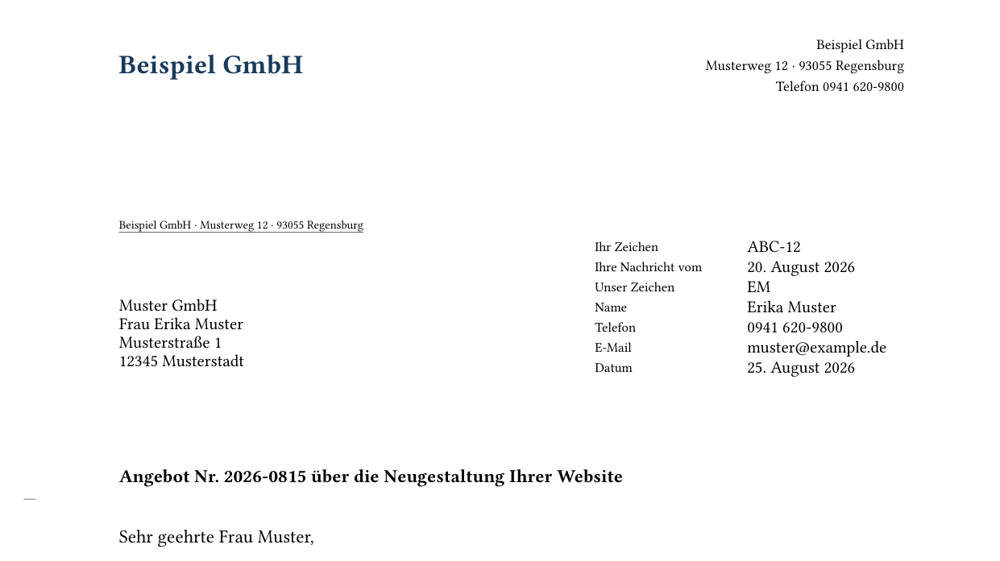
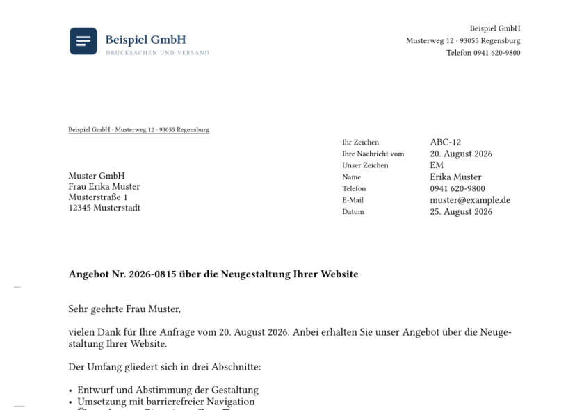
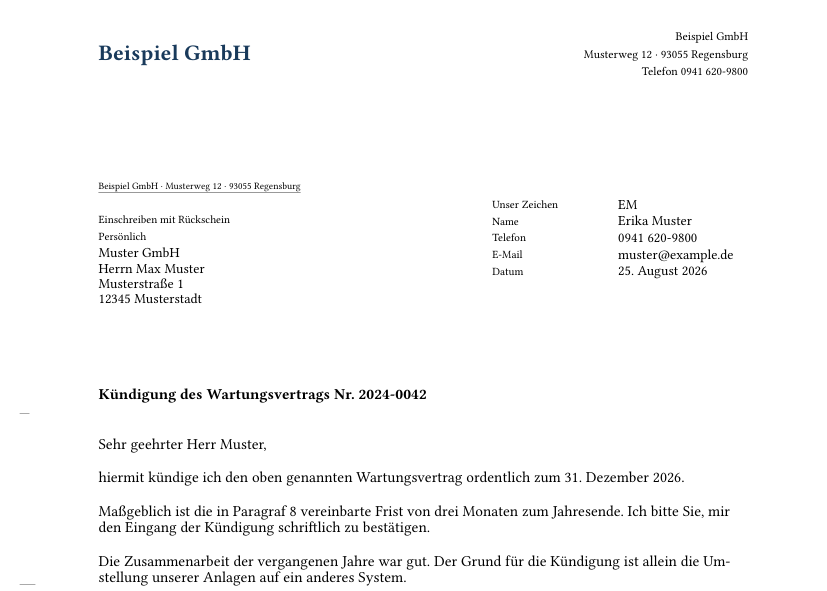
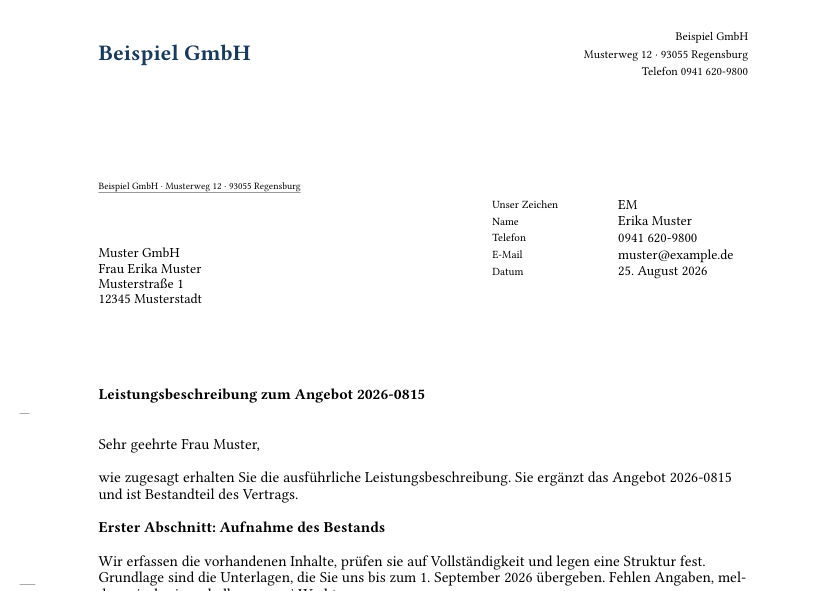

<div align="center">

<picture>
  <source media="(prefers-color-scheme: dark)" srcset="docs/assets/brand/logo-dark.svg">
  
</picture>

<p><em>German business letters per DIN 5008 — written in Markdown, rendered to PDF/A, and geometrically verified.</em></p>

[](https://github.com/blitzsicht/normbrief/actions/workflows/ci.yml)
[](https://github.com/blitzsicht/normbrief/releases/latest)
[](LICENSE)
[](pyproject.toml)
[](skill/references/din5008.md)

</div>

---

Schreibe den Inhalt als Markdown mit YAML-Frontmatter. normbrief macht daraus einen Geschäftsbrief
nach **DIN 5008:2020** als **PDF/A-2b** — mit Anschriftfeld für Fensterumschläge,
Informationsblock, Falz- und Lochmarken sowie Briefkopf und Fußzeile aus einem Absenderprofil.
Anschließend wird **das fertige PDF nachgemessen**: Sitzt die Falzmarke nicht auf 105,0 mm oder
steht der Betreff einen Millimeter zu tief, endet der Lauf mit einem Fehler statt mit einem Brief,
der nur ungefähr stimmt.

<div align="center">

**[⬇ Skill herunterladen](https://github.com/blitzsicht/normbrief/releases/latest/download/normbrief.skill)** · **[Schnellstart](#schnellstart)** · **[Beispiele](#beispiele)**

</div>

---

## Was dabei herauskommt



Und was danach geprüft wird — Auszug aus dem Bericht, den jeder Lauf ausgibt:

```
OK    Falzmarke 1, y: soll 105.00 ist 105.00 (tol ±0.3)
OK    Infoblock, x-links: soll 125.00 ist 125.00 (tol ±0.5)
OK    Betreff, y-Oberkante: soll 98.47 ist 97.91 (tol -1.75/+0.6)
OK    Abstand Betreff → Anrede (2 Leerzeilen): soll 12.70 ist 12.70 (tol ±0.2)
```

## Warum normbrief

Eine Briefvorlage kann nicht prüfen, ob das Ergebnis stimmt. Sie wird kopiert, jemand verschiebt
eine Zeile, und der Fehler fällt erst auf, wenn der Brief im Fensterumschlag nicht mehr lesbar ist
oder die Post ihn als nicht automationsfähig zurückgibt.

Sprachmodelle verschärfen das: Sie formulieren gut, aber sie können keinen Text auf 45,0 mm setzen.
Wer einen Brief von einer KI schreiben lässt, bekommt zuverlässig guten Inhalt in unzuverlässigem
Layout.

normbrief trennt beides. Der Inhalt kommt als Markdown — lesbar, versionierbar, diffbar. Das
Layout setzt ein Renderer, der es immer gleich macht. Und weil auch ein Renderer Fehler haben kann,
wird das Ergebnis gemessen statt angeschaut.

## Funktionen

- **DIN 5008 Form A und B** — Anschriftfeld mit allen vier Zonen, Informationsblock bei 125 mm, Falz- und Lochmarken, 12-pt-Raster.
- **Markdown als Quelle** — der Brieftext bleibt lesbar und versionierbar; das PDF ist Ergebnis, nicht Quelle.
- **Geometrieprüfung** — jedes erzeugte PDF wird gegen die Maßtabelle vermessen; Abweichung heißt Fehler, nicht Warnung.
- **PDF/A-2b als Standard** — archivfest für GoBD und Dokumentenverwaltung, ohne zusätzliches Flag.
- **Absenderprofile** — Briefkopf, Fußzeile, Logo, Farben und Voreinstellungen einmal anlegen, überall verwenden.
- **Claude-Skill und CLI** — im Gespräch mit Claude oder direkt im Terminal, ohne Systeminstallation.

## Schnellstart

### Mit Claude

1. **[`normbrief.skill` herunterladen](https://github.com/blitzsicht/normbrief/releases/latest/download/normbrief.skill)**
2. In Claude unter Einstellungen › Capabilities hochladen (Tarif mit Code-Ausführung nötig).
   Für Claude Code genügt ein Symlink, siehe [Als Claude-Skill](#als-claude-skill).
3. „Schreib einen Brief an die Muster GmbH, Angebot über …"

### Im Terminal

```bash
git clone https://github.com/blitzsicht/normbrief.git
cd normbrief
python3 skill/scripts/bootstrap.py
python3 skill/scripts/normbrief.py render examples/brief-form-b.md --png
```

`bootstrap.py` holt `typst`, `pyyaml` und `pymupdf`. Der Typst-Compiler kommt als Python-Wheel mit —
**keine Systeminstallation**: kein LaTeX, kein wkhtmltopdf, keine Schriftinstallation.

## Einen Brief schreiben

```markdown
---
profil: example
empfaenger:
  - Muster GmbH
  - Frau Erika Muster
  - Musterstraße 1
  - 12345 Musterstadt
datum: 2026-08-25
betreff: Angebot Nr. 2026-0815 über die Neugestaltung Ihrer Website
anrede: Sehr geehrte Frau Muster,
anlagen:
  - Angebot 2026-0815
---
vielen Dank für Ihre Anfrage vom 20. August 2026. Anbei erhalten Sie unser Angebot.

Die Umsetzung dauert ab Ihrer Freigabe **sieben Werktage**.
```

```bash
python3 skill/scripts/normbrief.py render brief.md --png
```

Alle Felder stehen in [`skill/references/frontmatter.md`](skill/references/frontmatter.md).

## Ausgabe und Prüfung

```
brief.md
   ↓ render
brief.pdf + brief.png
   ↓ check  (läuft automatisch mit)
28 Prüfungen · Exit 0
```

| Exit | Bedeutung |
|---|---|
| 0 | PDF geschrieben, alle Maße eingehalten |
| 1 | Eingabefehler — mit Feldname und Zeilennummer |
| 2 | Geometrieprüfung gescheitert — mit Soll, Ist und Toleranz |
| 3 | Umgebung unvollständig |

Geprüft werden Seitenformat, Falz- und Lochmarken, alle vier Zonen des Anschriftfelds, Position und
Breite des Informationsblocks, die Betreffposition relativ zum tiefer reichenden der beiden Blöcke,
Satzspiegel, die Zeilenabstände im 12-pt-Raster, eingebettete Schriften, die PDF/A-Kennzeichnung
und die Folgeseiten.

Die Sollwerte stehen an genau einer Stelle und gelten für Prüfung und Testsuite gemeinsam. Dazu
kommen [Gegenproben](tests/test_gegenbeweis.py): Jede tragende Prüfung wird gegen ein absichtlich
verschobenes Layout gefahren und muss dort anschlagen — ein Prüfmittel, das nie rot werden kann,
wäre kein Nachweis.

```bash
python3 -m pytest -q
```

## Als Claude-Skill

```bash
ln -s "$PWD/skill" ~/.claude/skills/normbrief          # global
ln -s "$PWD/skill" .claude/skills/normbrief            # nur dieses Projekt
```

Auf claude.ai: das Release-Asset
[`normbrief.skill`](https://github.com/blitzsicht/normbrief/releases/latest/download/normbrief.skill)
unter Einstellungen › Capabilities hochladen.

## Befehle

```
normbrief.py render      BRIEF.md [-o AUS.pdf] [--png] [--no-pdfa] [--profiles DIR]
normbrief.py check       AUS.pdf --form B [--json]
normbrief.py preview     BRIEF.md [-o AUS.png] [--ppi 120]
normbrief.py profiles
normbrief.py init        ZIEL.md --profil NAME [--empfaenger "Zeile|Zeile"] [--betreff "..."]
normbrief.py init-profil NAME [--ziel VERZEICHNIS]
normbrief.py lint        BRIEF.md [--json]
normbrief.py verify      AUS.pdf [--form B] [--json] [--verbose]
normbrief.py pack        --profil NAME [-o ZIEL.skill]
```

Aufruf im geklonten Repo mit `python3 skill/scripts/normbrief.py …`. Ein installierbarer Befehl
`normbrief` kommt mit der PyPI-Veröffentlichung
([#7](https://github.com/blitzsicht/normbrief/issues/7)).

## Absenderprofile

Ein Profil ist eine YAML-Datei mit Briefkopf, Fußzeile, Rücksendeangabe und Voreinstellungen.

```bash
python3 skill/scripts/normbrief.py init-profil meinefirma
```

Das legt eine ausgefüllte Vorlage unter `~/.config/normbrief/profiles/` an — **außerhalb der
Installation**, damit sie ein Update übersteht. Gesucht wird in dieser Reihenfolge:
`--profiles` → `NORMBRIEF_PROFILES` → `./profiles/` (zum Vorgang gehörend) →
`~/.config/normbrief/profiles/` → mitgelieferte Beispiele.

Wer den Briefkopf frei gestalten will, setzt `briefkopf_typ: meinkopf.typ` und legt daneben eine
Typst-Datei mit einer Funktion `briefkopf(profil)` — Beispiel:
[`example-kopf.typ`](skill/typst/profiles/example-kopf.typ). Das Anschriftfeld bleibt davon
unberührt, seine Höhe erzwingt das Layout. Für alles andere reicht YAML.

`profil:` nimmt außerdem einen Pfad (`./profile/firma.yaml`) oder die Felder direkt im
Frontmatter — nützlich auf claude.ai, wo kein Verzeichnis den nächsten Chat überlebt. Für
diesen Fall erzeugt `normbrief.py pack --profil meinefirma` ein Skill-Zip mit eingebackenem
Absender.

## Beispiele

| Standardbrief | Einschreiben | Mehrseitig |
|---|---|---|
|  |  |  |
| Form B mit Informationsblock | Zusatz- und Vermerkzone | Kopfzeile und Seitenzählung |

Dazu Form A, Auslandsanschrift, Tabelle und ein Brief mit langem Informationsblock —
[alle sieben Beispiele](examples/) und ihre [vollständigen Renderings](docs/renders/).

## Grenzen

- **normbrief-Markdown (CommonMark-Teilmenge)**: Absätze, fett, kursiv, Aufzählungen,
  nummerierte Listen, harter Umbruch, Pipe-Tabellen. Alles andere bricht mit Zeilenangabe ab, statt still etwas anderes zu setzen.
- **Zonengrößen der Norm**: Anschrift höchstens 6 Zeilen, Vermerke höchstens 3, Werte im
  Informationsblock höchstens 32 Zeichen.
- **Keine Bilder im Fließtext** — ein Logo gehört ins Profil.
- **Nur DIN 5008.** Schweiz (SN 010130) und Österreich (ÖNORM A 1080) sind vorgemerkt
  ([#10](https://github.com/blitzsicht/normbrief/issues/10)); das Frontmatter-Feld `norm:` ist dafür
  reserviert.

## Aufbau

```
skill/                      der Claude-Skill, in sich lauffähig
├── SKILL.md
├── scripts/                CLI, Markdown-Konverter, Geometriemessung
├── typst/
│   ├── normbrief.typ       Layout-Wrapper
│   ├── vendor/             letter-pro v3.0.0 (MIT), unverändert
│   └── profiles/           example.yaml
├── assets/fonts/           Source Sans 3 (OFL)
└── references/             DIN-Maße, Stilregeln, Datenvertrag
examples/                   sieben Briefe, die die Testsuite rendert
tests/                      Geometrie, Gegenproben, Datenvertrag, CLI, Profilsuche
docs/normmasse.md           Herkunft der Maße, Gegenproben, Messmethodik
```

## Mitmachen

Fehlerberichte und Vorschläge sind willkommen — siehe [CONTRIBUTING.md](CONTRIBUTING.md).
Bei einem Geometriefehler bitte die Ausgabe von `check` mitschicken; ohne sie lässt sich nicht
unterscheiden, ob das Layout oder die Messung danebenliegt.

Sicherheitsrelevantes bitte nicht als Issue, sondern nach [SECURITY.md](SECURITY.md).

## Herkunft und Dank

**Markdown** wurde 2004 von [John Gruber](https://daringfireball.net/projects/markdown/) gemeinsam
mit Aaron Swartz entworfen. Die Spezifikation dazu ist [CommonMark](https://commonmark.org/)
(John MacFarlane und Mitwirkende). normbrief setzt eine dokumentierte Teilmenge von CommonMark um
— **normbrief-Markdown (CommonMark-Teilmenge)** — und weicht an drei Stellen bewusst ab: HTML wird
nie durchgereicht, Links werden nie gesetzt, und eine einzelne `2. Text`-Zeile ohne weitere
Listenpunkte ist ein Fehler statt einer Liste. Die vollständige Tabelle steht in
[`skill/references/frontmatter.md`](skill/references/frontmatter.md).

Das **Seitenlayout** stammt von [typst-letter-pro](https://github.com/Sematre/typst-letter-pro)
(MIT) von Sematre und ist unverändert vendort — Prüfsumme in
[`skill/typst/vendor/README.md`](skill/typst/vendor/README.md). normbrief ergänzt die Schicht
darüber: Datenvertrag, Profile, Markdown-Eingabe, Messung und den Skill.

Gesetzt wird mit [Typst](https://typst.app) (Apache-2.0), geparst mit
[markdown-it-py](https://github.com/executablebooks/markdown-it-py) (MIT), gemessen mit
[pdfplumber](https://github.com/jsvine/pdfplumber) (MIT) und
[pypdf](https://github.com/py-pdf/pypdf) (BSD-3). Schriften: Libertinus und Source Sans 3
(beide OFL 1.1).

**Alle Abhängigkeiten sind permissiv lizenziert** — normbrief lässt sich damit auch in
geschlossene Systeme einbauen. Die vollständige Aufstellung samt der Begründung, warum PyMuPDF
(AGPL-3.0) ersetzt wurde, steht in [THIRD_PARTY_LICENSES.md](THIRD_PARTY_LICENSES.md).

**DIN 5008** ist eine Norm des DIN Deutsches Institut für Normung e. V. Die Maße hier folgen
öffentlich dokumentierten Quellen ([`docs/normmasse.md`](docs/normmasse.md)). normbrief ist kein
Produkt des DIN, steht in keiner Verbindung zum DIN und behauptet keine Zertifizierung.

## Lizenz

[MIT](LICENSE)
