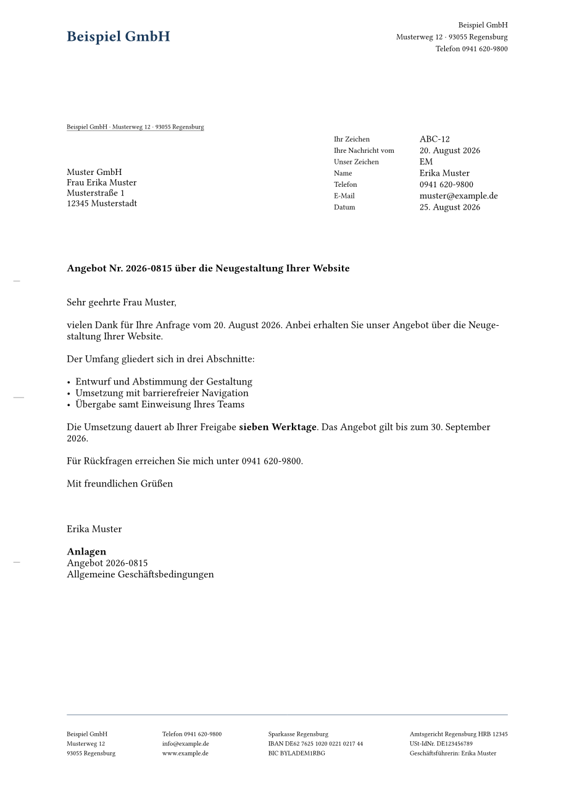

# normbrief

Geschäftsbriefe nach **DIN 5008:2020** aus einer Markdown-Datei — mit Falz- und Lochmarken,
Anschriftfeld für Fensterumschläge, Informationsblock, Briefkopf und Fußzeile aus
Absender-Profilen. Als PDF/A-2b, also archivfest.

Der Unterschied zu einer Briefvorlage: **jedes erzeugte PDF wird nachgemessen.** Sitzt die
Falzmarke nicht auf 105,0 mm oder steht der Betreff einen Millimeter zu tief, endet der Lauf mit
einem Fehler statt mit einem Brief, der nur ungefähr stimmt.

```bash
normbrief.py render brief.md
```

```
OK  PDF geschrieben: brief.pdf
OK    Falzmarke 1, y: soll 105.00 ist 105.00 (tol ±0.3)
OK    Anschrift, erste Zeile y: soll ≥ 62.7 ist 62.19 (tol -1.59)
OK    Betreff, y-Oberkante: soll 98.47 ist 97.91 (tol -1.75/+0.6)
OK    Abstand Betreff → Anrede (2 Leerzeilen): soll 12.70 ist 12.70 (tol ±0.2)
...
```

## Wofür

Für alle, die Briefe von einer KI schreiben lassen und trotzdem ein normgerechtes Ergebnis
brauchen. Ein Sprachmodell kann gut formulieren, aber es kann keinen Text auf 45,0 mm setzen.
Deshalb liefert es hier nur Inhalt — Markdown mit YAML-Frontmatter —, und ein Renderer setzt das
Layout.

Der Ordner `skill/` ist zugleich ein **Claude-Skill**: in Claude Code oder auf claude.ai
installiert, schreibt Claude den Brief, rendert ihn und zeigt die Vorschau.

## Ein Brief

```markdown
---
profil: example
empfaenger:
  - Muster GmbH
  - Frau Erika Muster
  - Musterstraße 1
  - 12345 Musterstadt
datum: 2026-08-25
betreff: Angebot Nr. 2026-0815 über die Neugestaltung Ihrer Website
anrede: Sehr geehrte Frau Muster,
anlagen:
  - Angebot 2026-0815
---
vielen Dank für Ihre Anfrage vom 20. August 2026. Anbei erhalten Sie unser Angebot.

Die Umsetzung dauert ab Ihrer Freigabe **sieben Werktage**.
```



Weitere Beispiele in [`examples/`](examples/): [Form A](docs/renders/brief-form-a.png),
[Einschreiben mit Vermerken](docs/renders/brief-einschreiben.png),
[Tabelle](docs/renders/brief-tabelle.png),
[langer Informationsblock](docs/renders/brief-infoblock-lang.png),
[Auslandsanschrift](docs/renders/brief-ausland.png),
[mehrseitig](docs/renders/brief-mehrseitig-1.png).

## Installation

```bash
git clone https://github.com/blitzsicht/normbrief.git
cd normbrief
python3 skill/scripts/bootstrap.py     # holt typst, pyyaml, pymupdf
```

Der Typst-Compiler kommt als Python-Wheel mit. Es ist **keine** Systeminstallation nötig —
kein LaTeX, kein wkhtmltopdf, keine Schriftinstallation.

**Als Claude-Skill in Claude Code:**

```bash
ln -s "$PWD/skill" ~/.claude/skills/normbrief
```

**Auf claude.ai:** das Release-Asset `normbrief.skill` unter Einstellungen › Capabilities
hochladen (erfordert einen Tarif mit Code-Ausführung).

## Befehle

```
normbrief.py render  BRIEF.md [-o AUS.pdf] [--png] [--no-pdfa] [--profiles DIR]
normbrief.py check   AUS.pdf --form B [--json]
normbrief.py preview BRIEF.md [-o AUS.png] [--ppi 120]
normbrief.py profiles
normbrief.py init    ZIEL.md --profil NAME [--empfaenger "Zeile|Zeile"] [--betreff "..."]
```

| Exit | Bedeutung |
|---|---|
| 0 | PDF geschrieben, alle Maße eingehalten |
| 1 | Eingabefehler — mit Feld und Zeilennummer |
| 2 | Geometrieprüfung gescheitert |
| 3 | Umgebung unvollständig |

## Absender-Profile

Ein Profil ist eine YAML-Datei mit Briefkopf, Fußzeile, Rücksendeangabe und Voreinstellungen.
`skill/typst/profiles/example.yaml` zeigt alle Felder. Eigene Profile gehören nach
`skill/typst/profiles.local/` (nicht versioniert), in ein Verzeichnis aus `NORMBRIEF_PROFILES`
oder hinter `--profiles`.

Wer den Briefkopf frei gestalten will, legt eine gleichnamige `.typ`-Datei daneben; für alles
andere reicht YAML.

## Was geprüft wird

Nach jedem Render misst [`geometrie.py`](skill/scripts/geometrie.py) das fertige PDF mit PyMuPDF:
Seitenformat, Falz- und Lochmarken, alle vier Zonen des Anschriftfelds, Position und Breite des
Informationsblocks, Betreffposition relativ zum tieferen der beiden Blöcke, Satzspiegel,
Zeilenabstände im 12-pt-Raster, eingebettete Schriften, PDF/A-Kennzeichnung und die Folgeseiten.

Die Sollwerte stehen an einer Stelle und gelten für Prüfung und Tests gemeinsam. Die Testsuite
enthält außerdem [Gegenproben](tests/test_gegenbeweis.py): Jede Prüfung wird gegen ein absichtlich
verschobenes Layout gefahren und muss dort anschlagen — ein Prüfmittel, das nie rot werden kann,
wäre kein Nachweis.

```bash
python3 -m pytest -q
```

## Grenzen

- Markdown-Teilmenge: Absätze, fett, kursiv, Listen, harter Umbruch, Pipe-Tabellen. Alles andere
  bricht mit Zeilenangabe ab, statt still etwas anderes zu setzen.
- Anschrift höchstens 6 Zeilen, Vermerke höchstens 3, Werte im Informationsblock höchstens
  32 Zeichen — das sind die Zonengrößen der Norm.
- Nur DIN 5008. Schweiz (SN 010130) und Österreich (ÖNORM A 1080) sind vorgemerkt; das Feld
  `norm:` ist dafür reserviert.

## Aufbau

```
skill/                      der Claude-Skill, in sich lauffähig
├── SKILL.md
├── scripts/                CLI, Markdown-Konverter, Geometriemessung
├── typst/
│   ├── normbrief.typ       Layout-Wrapper
│   ├── vendor/             letter-pro v3.0.0 (MIT), unverändert
│   └── profiles/           example.yaml
├── assets/fonts/           Source Sans 3 (OFL)
└── references/             DIN-Maße, Stilregeln, Datenvertrag
examples/                   sieben Briefe, die die Testsuite rendert
tests/                      Geometrie, Gegenproben, Datenvertrag, CLI
```

## Dank

Das Seitenlayout stammt von [typst-letter-pro](https://github.com/Sematre/typst-letter-pro)
(MIT) von Sematre und ist unverändert vendort. normbrief ergänzt die Schicht darüber:
Datenvertrag, Profile, Markdown-Eingabe, Messung, Skill.

## Lizenz

MIT
